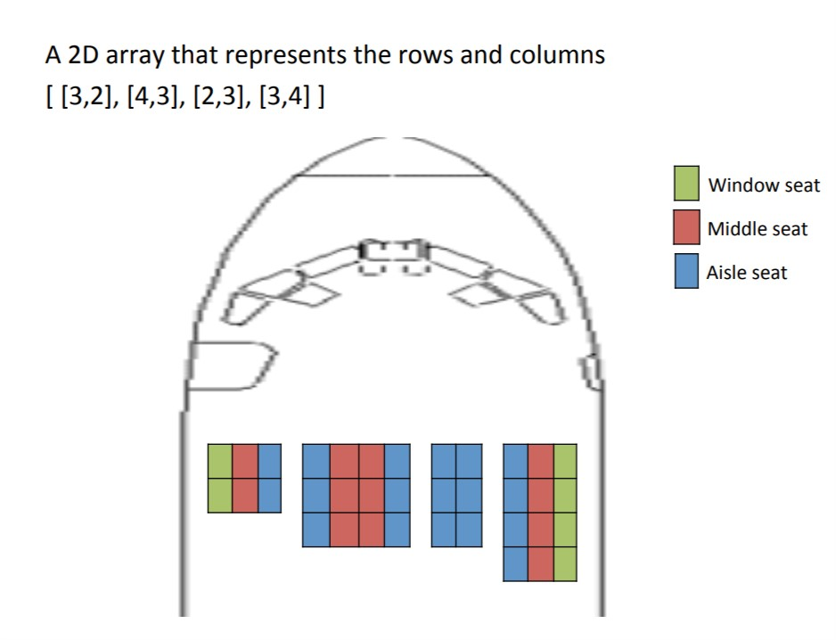
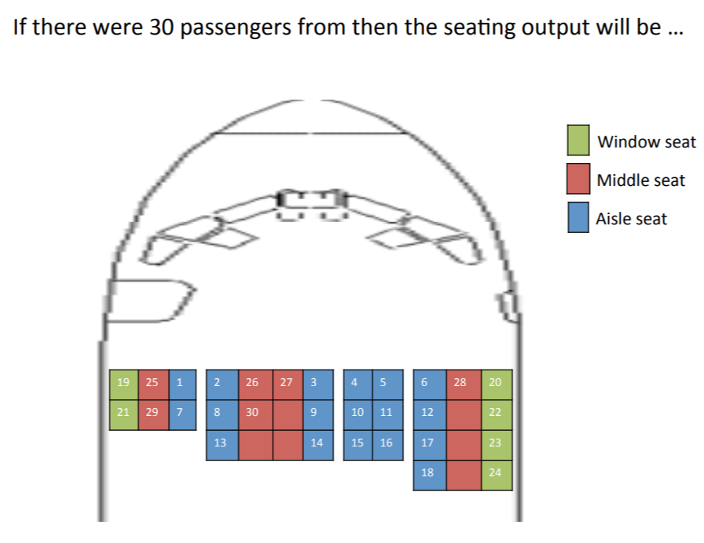
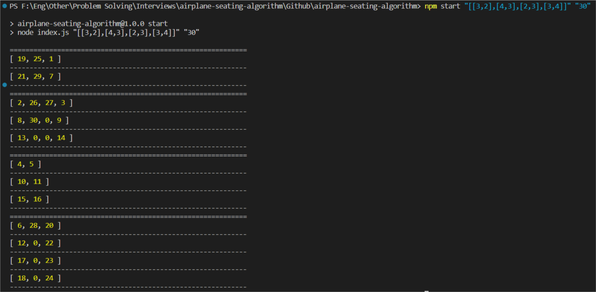
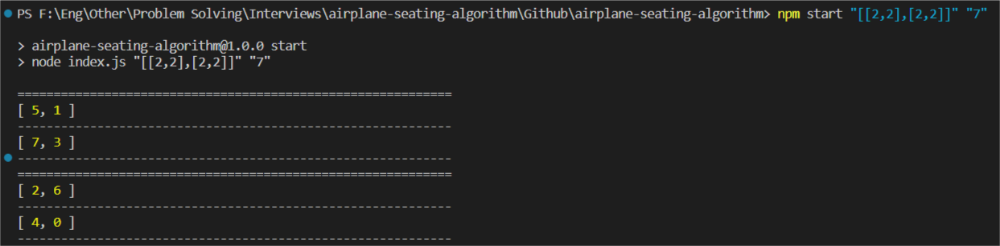

# Airplane Seating Algorithm

<h2>Table of Contents</h2>
<ul>
  <li><a href="#built-with--">Built With</a></li>
  <li><a href="#getting-started">Getting Started</a></li>
  <li><a href="#Description">Description</a></li>
  <li><a href="#Screenshots">Screenshots</a></li>
</ul>

<h2 href="#BuiltWith">Built With : </h2>
 <ul>
  <li><a href="https://www.w3schools.com/nodejs/">Node js</a></li>
  <li><a href="https://eslint.org/">ESLint</a></li>
 </ul>

<h2 href="#GettingStarted">Getting Started</h2>
<blockquote>
  
This is a list of needed instructions to set up your project locally, to get a local copy up and running follow these instructions.
 

</blockquote>
<ol>
<li>
  <h4>Clone the repository.</h4>
 </li>
 <li>
  <h4>Follow this article to install node js and npm <a href="https://phoenixnap.com/kb/install-node-js-npm-on-windows">Install Node js and npm.</a></h4>
 </li>
 <li>
  <h4><code>npm i && npm start "[[3,2],[4,3],[2,3],[3,4]]" "30"</code></h4>
 </li>
 </ol>

<h2 href="#Description">Description</h2>
<blockquote>
  

  A simple Node.js program that gives the seating arrangement of passengers for airplane seat layout with custom conditions.
 

 This program was built for a coding challenge, you can see the requirements file in <code>documentation/requirements.pdf</code>

Rules for seating:
<ul>
<li>
Always seat	passengers starting	from the front row to back, starting from the left to the right.
</li>
<li>
Fill aisle seats first followed by window seats followed by center seats (any order in center seats)
</li>
</ul>	

</blockquote>

<h2 href="#Screenshots">Screenshots</h2>
<ol>
<li>
  <h4>Example from requirements.</h4>
  
</li>
<li>
  <h4>Expected output.</h4>
  
</li>
<li>
  <h4>Output example (1), note that 0 means an empty seat.</h4>
  
</li>
<li>
  <h4>Output example (2).</h4>
  
</li>
